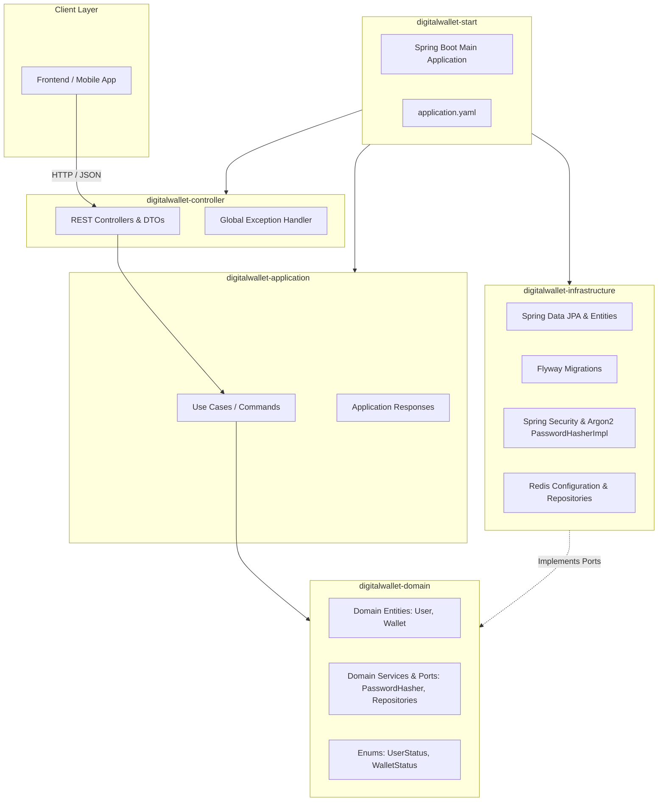
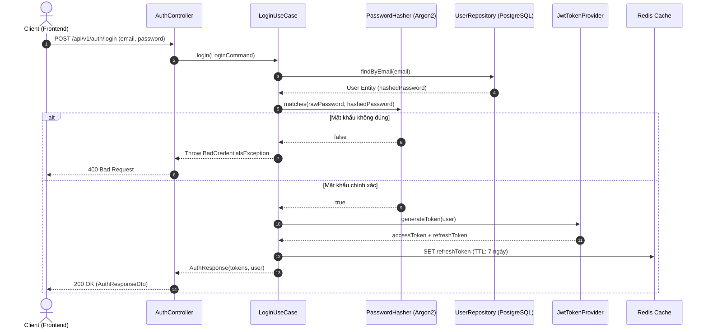

# 🏛️ Digital Wallet Architecture

Dự án **Digital Wallet** được thiết kế theo trường phái **Domain-Driven Design (DDD)** kết hợp **Hexagonal Architecture (Ports and Adapters)** nhằm tối ưu hóa tính độc lập của nghiệp vụ tài chính, dễ kiểm thử và sẵn sàng mở rộng.

---

## 1. Kiến trúc phân tầng 5 Modules (DDD)

### Chi tiết các Module:
| Module | Trách nhiệm chính |
| :--- | :--- |
| **`digitalwallet-domain`** | **Lõi nghiệp vụ (Core Domain)**: Chứa các Entity thuần túy (`User`, `Wallet`), các quy tắc nghiệp vụ tài chính (Rich Domain Model), và các Interface Ports (`UserRepository`, `WalletRepository`, `PasswordHasher`). Hoàn toàn không phụ thuộc vào bất kỳ framework bên ngoài nào. |
| **`digitalwallet-application`** | **Tầng Ứng dụng (Orchestration)**: Hiện thực các Use Case (`RegisterUseCase`, `LoginUseCase`, `CreateWalletUseCase`, `DepositMoneyUseCase`, `WithdrawUseCase`), định nghĩa Command và Response. Điều phối luồng nghiệp vụ giữa Domain và Repository. |
| **`digitalwallet-controller`** | **Tầng Giao tiếp (Inbound Adapter)**: Expose RESTful API endpoints (`/api/v1/auth/**`, `/api/v1/users/**`, `/api/v1/wallet/**`), nhận Request DTO, validate và trả về `ApiResponse<T>` chuẩn hóa. |
| **`digitalwallet-infrastructure`** | **Tầng Hạ tầng (Outbound Adapter)**: Hiện thực hóa các interface từ Domain: Spring Data JPA, Hibernate, PostgreSQL, Flyway migration, Spring Security (Argon2), Redis Client. |
| **`digitalwallet-start`** | **Tầng Khởi chạy (Bootstrapper)**: Chứa hàm `main()` Spring Boot, kết nối và cấu hình toàn bộ ứng dụng chạy trên port `3006`. |

---

## 2. Luồng Xác thực (Authentication Flow)

---

## 3. Chiến lược Kiểm soát Đồng thời & Chống Double-Spending

Trong giao dịch tiền tệ (Nạp / Rút / Chuyển tiền):
- Sử dụng **Pessimistic Locking (`SELECT ... FOR UPDATE`)** hoặc **Redis Distributed Lock (Redisson)** để đảm bảo mỗi chiếc ví tại một thời điểm chỉ được thực hiện 1 giao dịch biến động số dư duy nhất.
- Mọi giao dịch biến động số dư đều được bảo vệ trong một Spring `@Transactional` duy nhất: Trừ tiền ví + Ghi bản ghi sổ cái (Transaction Ledger).
