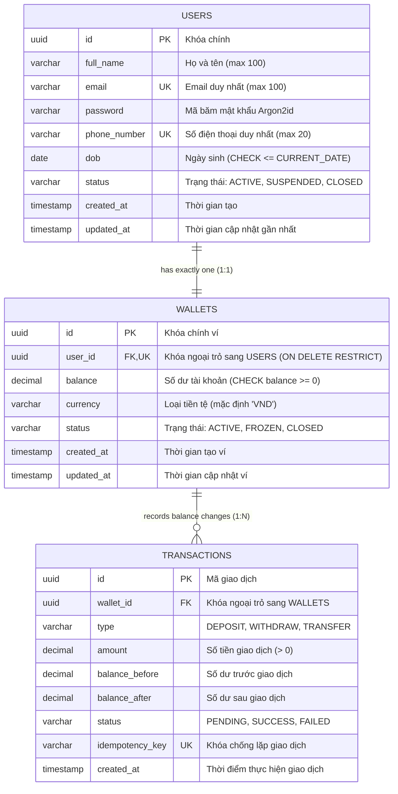

# 🗄️ Database Schema & Entity Relationship Diagram (ERD)

Hệ cơ sở dữ liệu: **PostgreSQL 16**  
Công cụ quản lý phiên bản: **Flyway Database Migration**

---

## 1. Sơ đồ Quan hệ Thực thể (ERD)

---

## 2. Các Ràng buộc An toàn Cấp Database (Integrity Constraints)

1. **Bảo vệ số dư không âm (`chk_wallets_balance`)**:
   - `CHECK (balance >= 0)`: Ngăn chặn triệt để tình trạng số dư bị âm ở tầng vật lý, bất chấp lỗi logic từ code.
2. **Ngăn chặn xóa người dùng có ví (`fk_wallets_user`)**:
   - `ON DELETE RESTRICT`: Tuyệt đối không cho phép xóa bản ghi `users` nếu ví của họ vẫn đang tồn tại nhằm bảo vệ dữ liệu tài chính.
3. **Mỗi người dùng sở hữu duy nhất 1 ví (`uq_wallets_user_id`)**:
   - Ràng buộc `UNIQUE(user_id)` trên bảng `wallets`.
4. **Độ tuổi hợp lệ (`chk_users_dob`)**:
   - `CHECK (dob <= CURRENT_DATE)`: Ngày sinh không thể nằm ở tương lai.
